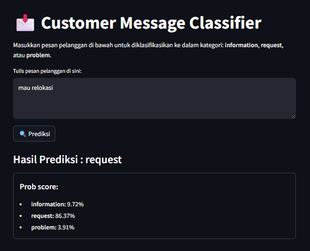

# Biznet Customer Message Classifier

Proyek ini bertujuan untuk mengklasifikasikan pesan pelanggan ke dalam tiga kategori:
- **Information**
- **Request**
- **Problem**

---

# Instalasi

### 1. Persiapan Python Environment
Gunakan Python versi **3.11**. Disarankan untuk membuat environment terpisah (misalnya dengan `venv` atau `conda`).
```bash
# Buat virtual environment
python3.11 -m venv env
source env/bin/activate   # Linux/macOS
env\Scripts\activate      # Windows
```

### 2. Install Dependencies
```bash
pip install -r requirements.txt
```

### 3. Install Jupyter Kernel
```bash
python -m ipykernel install --user --name=biznet_test_project_1 --display-name "biznet_test_project_1"
```

---

# Menjalankan Program
### 1. Training Data
Latih model klasifikasi menggunakan dataset yang telah dilabeli. (Opsional, jalankan prompt ini jika ingin mengulangi proses training)
```bash
python training_data.py
```

### 2. Inference (Prediksi)
Jalankan aplikasi inference menggunakan Streamlit:
```bash
streamlit run app/main.py
```


---

# Work Flow
### 1. Preprocessing data
code: project_1/notebook/data_labelling.ipynb

Tahapan ini dilakukan untuk perprocessing data sebelum masuk ke tahap training data. Adapun proses yang dilakukan yaitu:
- Menghapus data duplikat.
- Karena dataset masih belum memiliki label, sehingga perlu dilakukan pelabelan dengan pendekatan:
    - labeling dengan clustering data
    - labeling dengan regex
    - labeling manual
- Dari proses diatas, didapatkan 1187 data yang berhasil dilabelkan.

### 2. Training Data
code: project_1/notebook/data_classification.ipynb

Seletah dataset memiliki label, dilanjutkan untuk melakukan proses training data untuk mendapatkan model klasifikasi.
- Dataset dibagi menjadi data training dan testing dengan perbandingan 80:20.
- Proses training dilakukan dengan membandingkan beberapa algoritma klasifikasi, dan didapatkan Logistic Regression memberikan akurasi terbaik.
- Hasil evaluasi alogritma Logistic Regression yaitu:
    - accuracy: 96%
    - precision: 94%
    - recall: 86%
    - f1-score: 90%
- Model diexport ke dalam format pickle agar dapat digunakan dalam proses Inference (prediksi).

### 3. Inference (Prediksi)
code: project_1/app/main.py

Proses Inference atau prediksi digunakan untuk melakukan proses prediksi atau klasifikasi berdasarkan data baru. UI dibuat dengan menggunakan package Streamlit. Dan model yang digunakan adalah model yang sudah ditraining pada tahap sebelumnya.