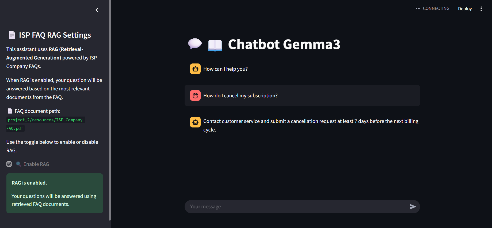

# ChatBot

Proyek membuat chatbot LLM dengan menggunakan model gemma3:1b dari Ollama.

---

# Instalasi

### 1. Install Ollama
- install ollama pada https://ollama.com/download
- selanjutnya install model gemma3:1b
```bash
ollama run gemma3:1b
```

### 2. Persiapan Python Environment
Gunakan Python versi **3.11**. Disarankan untuk membuat environment terpisah (misalnya dengan `venv` atau `conda`).
```bash
# Buat virtual environment
python3.11 -m venv env
source env/bin/activate   # Linux/macOS
env\Scripts\activate      # Windows
```

### 3. Install Dependencies
```bash
pip install -r requirements.txt
```

### 4. Install Jupyter Kernel
```bash
python -m ipykernel install --user --name=biznet_test_project_2 --display-name "biznet_test_project_2"
```

---

# Menjalankan Program

Jalankan aplikasi inference menggunakan Streamlit:
```bash
cd project_2
streamlit run app/main.py
```


---

# Work Flow
Project ini memanfaatkan local LLM dari Ollama dengan menggunakan model gemma3:1b.

Terdapat beberapa proses yang dilakukan:

### 1. History Message & Trimming
Dalam program LLM yang dibuat, semua percakapan yang dilakukan akan disimpan, sehingga LLM masih akan menjawab pertanyaan-pertanyaan berikutnya secara relevan berdasarkan riwayat percakapan sebelumnya.

Namun tentunya kita tidak bisa mengirimkan semua riwayat percakapan tiap kali mengirim pertanyaan/prompt ke LLM. Karena LLM hanya bisa membaca dan memproses sejumlah token dalam sekali proses sesuai context windownya. Sehingga Trimming dilakukan untuk memangkas riwayat percakapan yang akan dikirim ke LLM.


### 2. RAG
Chatbot yang dibuat saat ini bisa melakukan percakapan dengan RAG dan tanpa RAG. RAG (Retrieval-Augmented Generation) adalah metode yang menggabungkan pencarian dokumen relevan (retrieval) dengan generasi jawaban oleh LLM.

RAG yang dilakukan dalam aplikasi ini menggunakan dokumen yang berisikan FAQ berkaitan dengan perusahaan ISP. Dokumen dapat diliha pada `project_2/resources/ISP Company FAQ.pdf`.

Adapun proses RAG yang dilakukan yaitu:
- Loading document: digunakan untuk membaca data dari suatu source (dalam kasus ini menggunakan dokumen PDF).
- Spliiting document: digunakan untuk membagi dokumen ke beberapa bagian.
- Embedding: digunakan untuk mengubah text dari jasil spilt ke dalam bentuk vector.
- storing document: digunakan untuk menyimpan hasil embedding ke dalam vector store.
- Retrieval: digunakan untuk mencari dokumen yang relevan dengan query yang diinputkan user.  